<p align="center">
  
</p>

<p align="center">
  <a href="https://linkedin.com/in/kananelo-mofokeng-b37bb43a0"></a>
  <a href="https://forgecommunity.dev"></a>
  <a href="https://github.com/ai-builder-circle"></a>
  
</p>

---

```python
class Kananelo:
    based_in   = "Johannesburg, ZA"
    studying   = "Software Engineering @ WeThinkCode_"
    heading_to = "Data Engineering (AWS)"          # job-ready by end of 2026
    building   = ["passport_pipeline", "FORGE"]
    also       = ["peer tutor @ WeThinkCode_", "speaker @ GDG Pretoria DevFest"]
    certs      = {"AWS AI Practitioner": "done", "AWS Cloud Practitioner": "in progress"}

    def philosophy(self):
        return "Ship daily. Prove it with code. Build yourself alongside people doing the same."
```

## 🔥 What I'm building

| Project | What it is | Stack |
|---|---|---|
| **[passport_pipeline](https://github.com/Kananelodev/passport-pipeline)** | SA fintech-flavoured data pipeline: **ingest → validate → govern**. My daily-commit vehicle for learning DE fundamentals properly. | Python · SQL · DuckDB |
| **[FORGE](https://github.com/ai-builder-circle)** | Invite-only, competence-gated builder community in Joburg. Electives, a 16-week Craft Track curriculum, and a culture of proof-of-work. | Vercel · Notion · Discord |
| **[Ephemeral](https://github.com/Kananelodev/Ephemeral)** | Exploring how to run AI on sensitive data without creating long-term security risk. | — |
| **Robot World** | Java client-server game: multi-stage Docker build, CI/CD pipeline fixes, 196 passing tests. | Java · Docker · GitHub Actions |

## 🏆 Hackathons

- **SMU Health Hackathon 2026** — Top 5 finalist with NexaCare (*Insulin Express*: chronic-medication fulfilment)
- **Momentum × Monkey & River 2026 Finals** — backend/gateway lead, Team ByteBinders (FastAPI, RAG pipeline, compliance layer)
- **MoMo Mini App Hackathon 2026** — digital burial society (umgalelo) on MoMo APIs: FastAPI, Postgres, Docker, CI

## 🧰 Toolbox

<p align="left">
  
</p>

## 🐍 Contribution pipeline

<picture>
  <source media="(prefers-color-scheme: dark)" srcset="https://raw.githubusercontent.com/Kananelodev/Kananelodev/output/snake-dark.svg"/>
  
</picture>

---

<p align="center"><sub>raw → trusted. one commit at a time.</sub></p>
